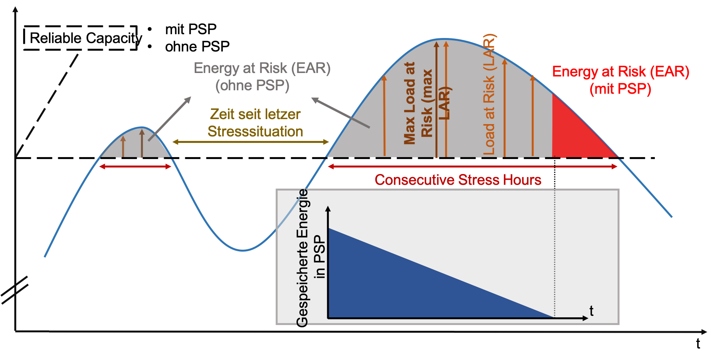

# Short-term developments in Security of Supply in the context of coal phase-out

*This is the english translation of the post originally post in German here in ET.*

### - Samarth Kumar, Dirk Hladik, David Beauty and Dominik Möst

Abstract: The share of energy from variable renewable energies (VRE) sources will be further increased and the secured generation capacities in Germany gradually is to be phased out. This raises the question of whether the high level of security of supply in electrical system in Germany can be maintained in short term (mid- twenties). Specially during critical 'dunkelflaute' - sustained high load paired with very low generation from VRE. Against this background, the paper investigates the short-term capacity development and security of supply for the year 2023 assuming that the intended capacity is completely eliminated from the market and is not available for a reserve.

With the phase-out of nuclear energy and the Commission's recommendations on "Growth, Structural Change and Employment", it is expected that around 26 GW of power plant capacity will be withdrawn from the market by 2023. This is offset by an increase of around 28 GW in-line with the German government's expansion targets for renewable energies. Due to the weather-dependent availability of renewable energies, the question arises to what extent sufficient capacities are available in situations of a *dunkelflaute*. The paper addresses this quesion. To this end, expected capacity developments and time series for weather and demand data will be used to identify appropriate indicators for critical capacity situations. Network infrastructure, in particular network congestion, is not considered in this simplified estimation.
In the first step, key figures for capacity development are determined and presented based on current data sources. On the basis of this data, a Monte Carlo simulation for different weather and demand situations is then carried out and indicators for critical situations are determined in order to draw conclusions.

## Determination of generation capacity for 2023
A central question for the security of supply in Germany in 2023 is how much dispatchable generation capacity will be available. The Federal Network Agency Power Plant List [1] is used as the starting point for capacity development and the Power Plant Decommissioning List [2] is used for the expected shutdowns, whereby the additions notified to the Federal Network Agency are also taken into account. **In addition, based on the Commission's recommends 'growth, structural change and employment', a minimum capacity of 15 GW each of coal and lignite capacity by the end of 2022. **

From these framework conditions, the bottleneck capacity ICC (Installed Congestion Capacity) can first be derived, which takes into account all non-weather-dependent generation capacities. For 2019, the ICC value is 115.1 GW (cf. Fig. 1). This will decrease by 26.2 GW by 2023 to an ICC of 88.9 GW. The 88.9 GW power plant capacity includes 9.8 GW of pumped storage capacity available to the German grid, even though 3.5 GW of this capacity is located in Austria and Luxembourg. As a rule, these PSP capacities contribute significantly to system security in Germany. It should be noted that the storage volume limits their availability.

Therefore, the PSP capacities are first deducted from the ICC value. The continuously available capacity CAC (Continuously Available Capacity) calculated with this is 79.1 GW. This will be adjusted for availability factors based on power plant type, which are based on [3] and can be seen under [4].

This results in a continuously reliable capacity (CRC) of 68.6 GW for 2023, which serves as the basis for the following analysis. The CRC value also includes current reserve power plant capacities which do not participate in the market. In order to analyze a comparison to the capacity value including PSP, a CRCPSP of 78.4 GW is used in addition to the CRC value presented, in which the PSP capacities are taken into account with 100% availability.

## Methodology and data
The methodological core is a comparison of the continuously secured capacity values (CRC / CRCPSP) presented in 2023 with residual loads in Germany. In order to account for the stochasticity of the residual load, a sequential Monte Carlo simulation was carried out using capacity factors (CF) based on historical weather and load years with corresponding time-series. All data are resolved hourly and at country level. Sixty CF time-series are combined with nine demand time series to obtain 540 possible residual load time series (Monte Carlo instances). These are then analysed in order to calculate the security of supply indicators defined below.  Possible Demand Side Management (DSM) are not taken into account, especially since the potential in the order of 1.5 GW can only make a small contribution and is not fully available in all hours. Two different open data sources are used for the capacity factors: EMHIRES [5] and Renewables.ninja [6]. Both sources provide CFs for photovoltaic (PV), wind onshore and wind offshore for 30 years (or more). Since none of the data sources is excluded for quality reasons, both sources are used as input data for the Monte Carlo simulation. For the hourly demand, data from 2009 to 2017 of the OPSD (Open Power System Data) are used, which are based on the ENTSO-E power statistics. The assumed wEE capacities in 2023 for PV, wind-onshore and wind-offshore plants are based on the expansion path of the EEG 2017 and the special tenders agreed in the meantime [7]. Since up to 14 GW of installed wind power could go off the grid within the next four years [8], a best case (HighRes) and a worst case (LowRes) of wEE capacities were compared [4].

Due to a large overlap of the observed peak residual loads, however, there is no major influence on the results, which is why the higher wEE capacity ("HighRes") was taken into account in the further course of the analysis. Germany's electricity import capacities to neighbouring countries, which, according to the Federal Government, will represent an important source of flexibility in the future [9], are not an input parameter for this analysis. In order to classify the results of this contribution, it should be noted that a planned import capacity of approx. 28.5 GW [3] should exist for 2020. However, this is not always available, even if it can be better exploited on average through the introduction of Flow Based Market Coupling (FBMC). In order to avoid overestimating import flexibility, the sum of the minimum import capacities in Germany secured for trade in 2017 of 5.2 GW [10, 11], for example, can serve as a guide. The data used for this article, the program code and further analyses can be found under [4].

## Indicators
In order to analyse the security of supply in 2023 for Germany, the following indicators are defined, which are also shown schematically in Fig. 2:
* **HAR (Hours at Risk):** is defined as the number of hours in a year in which the secured capacity (CRC) is not sufficient to meet demand.
* **LAR (Load At Risk):** This is defined as the difference between the residual load and the secured capacity (CRC or CRCmPSP). The Monte Carlo simulation can be used to calculate a distribution of this value. This value is zero if the secured capacity is greater than the residual load. For values greater than zero, there is a need for import capacity to ensure security of supply. A derived indicator from this is the LARmax, which represents the maximum value of the LAR within a stress situation (critical dark lull).
* **EAR (Energy at Risk):** This indicator calculates the amount of energy as the sum of the LAR within a stress situation. This is defined as a period of consecutive hours with positive LAR values and a maximum interruption of the same of 12 hours. The background is the limited PSP refill that occurs in such stress situations. In Germany it would take on average about 6 hours until a complete refilling at full pump capacity is achieved, whereby efficiency losses are neglected here. Moreover, the necessary pumping capacity should be available on the market and there should be a price incentive for filling the storage facilities. In order to take these circumstances into account, 12 hours were assumed for refilling and correspondingly individual stress instances were brought together at a smaller distance to form a stress situation.

## Capacity Risks
Fig. 3 shows the HAR for the two capacity cases: CRCmPSP with PSP and CRC without PSP. In the CRCmPSP case the HAR average is 1.76 h and has a standard deviation (SD) of 3.68 h. The 90-percentile of the HAR distribution is 6 h, whereby the maximum value goes up to 34h. For approximately 60% of Monte Carlo instances, the value of HAR is zero. However, if the PSP capacity is not taken into account in the CRC case, the HAR increases significantly to 128.5 h, which illustrates the sensitivity of the HAR to the secured capacity. Even in the more favourable case with the PSP capacities taken into account, there would be hours during which Germany would be dependent on the import capacities of its neighbours. The LAR value for the CRCmPSP case is 1.15 GW, with an SD of 0.99 GW, with a maximum value of up to approximately 5 GW.

This means that, with full PSP availability, the import dependency dimension of a maximum of 5 GW can be regarded as representable compared to the previously determined secure import capacity of 5.4 GW. However, it should be noted that the LAR value without PSP with 3.05 GW, an SD of 2.44 GW and a maximum value of up to approx. 15 GW appears much more critical. This illustrates the assumption that if the storage volumes of PSP are insufficiently filled, there would be a very high dependence on cross-border capacities, which is why the energy risks will be examined in more detail below.

## Energy risks
Fig. 4 shows the EAR value based on the CRC capacity, i.e. without taking PSP capacities into account. This results in the maximum energy requirements, which can then be compared with the maximum PSP energy storage volume. This makes it possible to analyse how much of the EAR can be provided by PSP. Each point in Figure 6 represents a possible constellation of EAR, read from the Y-axis, and length of the stress situation (Consecutive LAR Hours). The black horizontal line indicates the maximum amount of energy available in all PSP memories. The color tone of the dots additionally indicates the maximum LAR value for the respective stress situation.

The first finding is that the consecutive number of hours of stress can be up to 33 hours. The longer stress situations also have a higher energy requirement of up to approx. 250 GWh. This is significantly higher than the PSP storage volume of 58 GWh. In concrete terms, there are 1083 stress situations for 540 Monte Carlo simulation years in which the energy requirement could not be covered by the PSP.

The average duration of these stress situations is 17 hours, with an SD of 5.7 hours. The average energy to be imported during a stress situation (difference between EAR and PSP energy) is 33 GWh. It is also interesting to note that the mean value of the capacity that would have to be provided or imported by PSP at these times is 4.7 GW. This results in a maximum of 15 GW, which would still mean an import requirement of 6 GW even with a fully available PSP capacity. In addition, it can be observed that the LARmax values are exactly high at times when the energy stored in PSP is insufficient.

The most serious case observed involves an energy requirement of approx. 250 GWh in a long-term stress situation. Since only a maximum of 58 GWh of this could be provided by PSP, a gap of 192 GWh arises. These situations can last more than 30 hours. This illustrates once again that, in these extreme cases, PSP would not be in a position to guarantee security of supply and that Germany would have to rely on supplies from neighbouring countries, assuming that no further capacity than that assumed would be added.

## Conclusion and research outlook
These results show that Germany is dependent on its European neighbours to maintain security of supply, insofar as the reduction of secured power plant capacities, as described, occurs and no further capacities (than planned) are added or held in reserve and no load cut-off is taken into account. Pumped storage power plants can bridge short stress situations with an EAR below 58 GWh and a LARmax below 9 GW, but in longer stress situations, such as cold winters, the importance of imports increases.

The analysis shows that in some stress situations, the energy demand exceeds the maximum amount of energy stored in PSP, making electricity imports necessary. Due to its integration into the European electricity market, this poses no threat to the security of supply in Germany. Nevertheless, it is a situation that has not arisen so far due to existing capacities.
The analysis presented here is a first estimate of the possible consequences of the proposed phase-out of coal-fired power for Germany's capacity situation in 2023. Since this shows an increasing dependence of Germany on its neighbouring countries, the next questions are: do market prices rise sufficiently to encourage an expansion of generation and storage capacities in Germany to reduce import dependencies? And will the necessary capacities abroad be able to make a contribution to security of supply in situations of high residual loads in Germany? What role do capacity markets play in an integrated European electricity market?
Some simplifications have been made in the calculations, among others the present analysis neglects network infrastructure and bottlenecks, capacities for frequency maintenance as well as the availability of power plant capacities abroad in times of high residual loads. The basic statements of this contribution remain valid, but a refinement of the methodology to the mentioned aspects can bring additional insights and is therefore the subject of further research.

### References:
[1] Federal Network Agency: Power Plant List, 2019. https://www.bundesnetzagentur.de/DE/Sachgebiete/ElektrizitaetundGas/Unternehmen_Institutionen/Versorgungssicherheit/Erzeugungskapazitaeten/Kraftwerksliste/kraftwerksliste-node.html.\

[2] Federal Network Agency: Power Plant Decommissioning List, 2019. https://www.bundesnetzagentur.de/DE/Sachgebiete/ElektrizitaetundGas/Unternehmen_Institutionen/Versorgungssicherheit/Erzeugungskapazitaeten/KWSAL/KWSAL_node.html.

[3] ENTSO-E: TYNDP 2018. https://tyndp.entsoe.eu/maps-data.

[4] https://github.com/samarthiith/DE_CoalPhaseOut.

[5] Joint Research Centre (European Commission): EMHIRES, 2016. https://ec.europa.eu/jrc/en/publication/eur-scientific-and-technical-research-reports/emhires-dataset-part-i-wind-power-generation-european-meteorological-derived-high-resolution

[6] Pfenninger, S.; Staffell, I.: Long-term patterns of European PV output using 30 years of validated hourly reanalysis and satellite data. Energy 114, pp. 1251-1265. doi: 10.1016/j.energy.2016.08.060, https://www.renewables.ninja/downloads.

[7] BMWi: EEG amendment 2017, key points of the Bundestag resolution of 8.7.2016. https://www.mwi.de/Redaktion/DE/Artikel/Energie/eeg-2017-start-in-die-naechste-phase-der-energiewende.html.

[8] DWG Wallasch, A. K.; Lüers, S.; Rehfeldt, K.; Vogelsang, K.: Prospects for the continued operation of wind turbines after 2020.
https://www.wind-energie.de/fileadmin/redaktion/dokumente/publikationen-oeffentlich/themen/02-tchnik-und-netze/06-betrieb/perspektiven-fuer-den-weiterbetrieb-von-wea-nach-2020-v3c.pdf.

[9] BMWi: Federal Ministry of Economics and Energy: Electricity 2030 Long-term trends and tasks for the coming years, 2017. https://www.bmwi.de/Redaktion/DE/Publikationen/Energie/strom-2030-ergebnispapier.pdf?__blob=publicationFile&v=28.

[10] ENTSO-E: ENTSO-E Transparency Platform, 2018. https://transparency.entsoe.eu.

[11] JAO:  ATC Shadow Auction of the Joint Allocation Office utility tool, 2018. http://utilitytool.casc.eu/ATCShadowAuction.
S. Kumar, PhD Candidate Boysen College; D. Hladik, D. Schönheit, Research Assistant, Prof. Dr. D. Möst, Chair Holder, Chair of Energy Economics, TU Dresden
